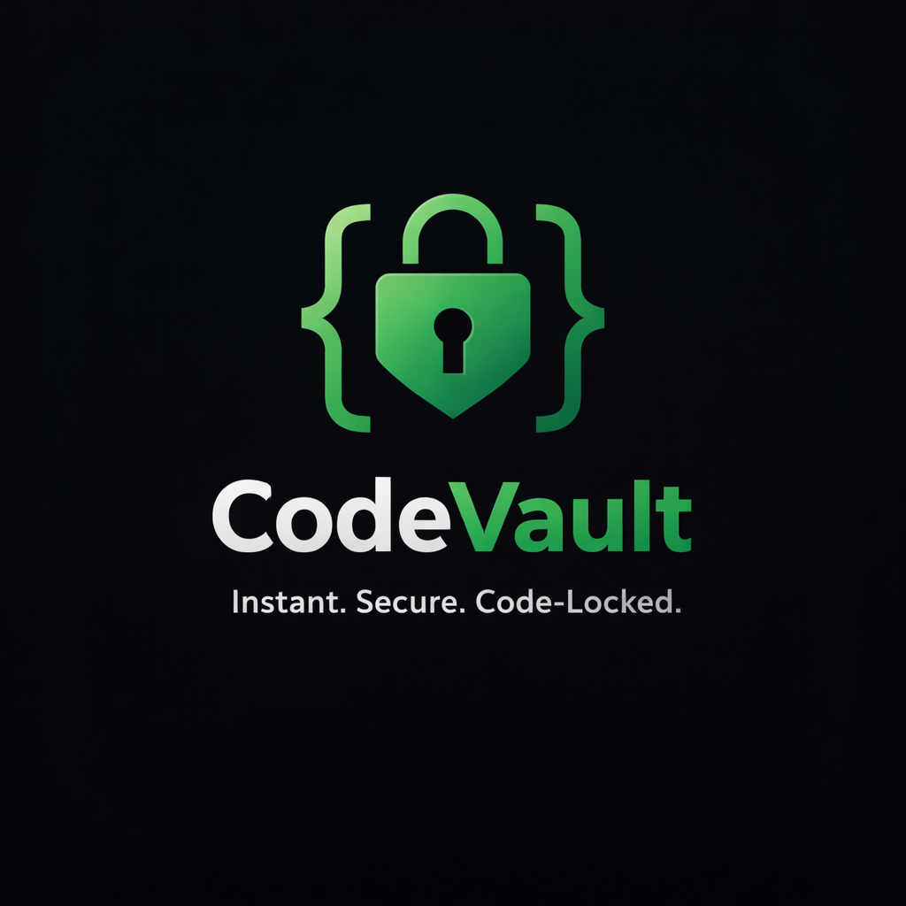
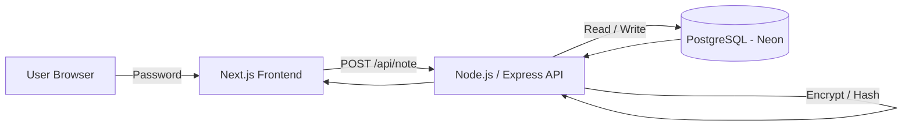
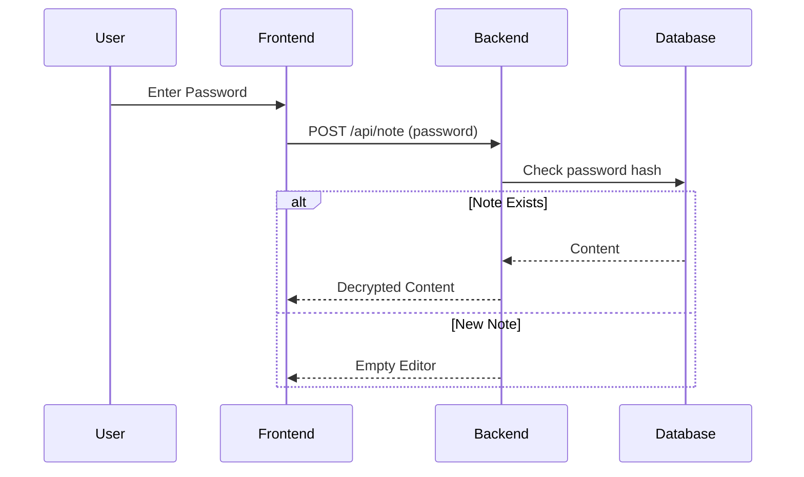
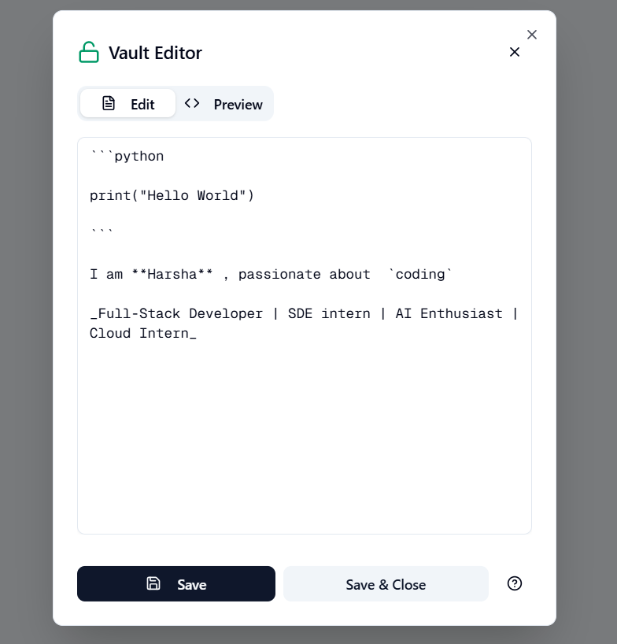
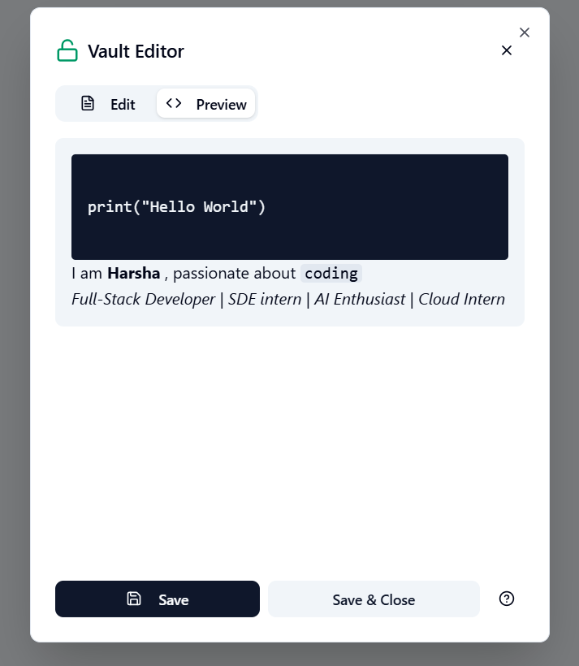
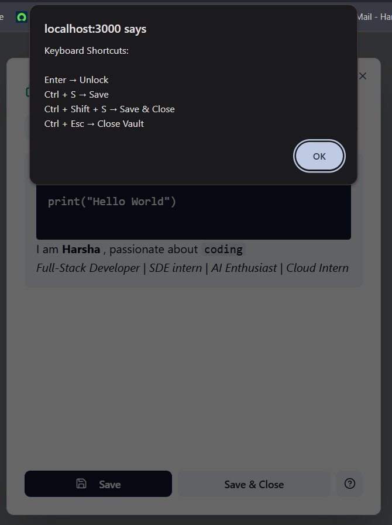

# 🔐 CodeVault

<p align="center">
  
</p>

<p align="center">
  <b>Instant. Secure. Code-Locked.</b><br/>
  Zero-account, password-locked notes built for speed, privacy, and control.
</p>

<p align="center">
  
  
  
  
</p>

---

## 🚀 What is CodeVault?

**CodeVault** is a lightweight, code-based note system where users access notes using a **single password** —
**no accounts, no signups, no tracking**.

It’s designed for:

* Developers
* Power users
* Secure note storage
* Quick access without friction

---

## ✨ Key Features

* 🔐 **Password-Locked Access** (no usernames)
* ⚡ **Instant Open / Save**
* 🧠 **Markdown + Code Friendly**
* ⌨️ **Keyboard Shortcuts (Power-User UX)**
* 🖥️ **Fullscreen Editor**
* 🛡️ **Encrypted Password Storage**
* 🧑‍💼 **Admin Moderation Ready**
* 📦 **No cookies, no analytics**

---

## 🧱 System Architecture



---

## 🧠 Core Flow



---

## 🖼️ Screenshots

### 🔑 Home / Unlock


### 🗂️ Vault Editor



### 👀 Markdown Preview



### ⌨️ Keyboard Shortcuts



---

## ⌨️ Keyboard Shortcuts

| Shortcut           | Action       |
| ------------------ | ------------ |
| `Enter`            | Unlock vault |
| `Ctrl + S`         | Save         |
| `Ctrl + Shift + S` | Save & Close |
| `Ctrl + Esc`       | Close vault  |

---

## 🔌 API Reference

### `POST /api/note`

Used for:

* Open note
* Save note
* Create note

#### Request

```json
{
  "password": "my-secret",
  "content": "optional note content"
}
```

#### Responses

**Open existing**

```json
{
  "exists": true,
  "content": "Saved content"
}
```

**Create / Update**

```json
{
  "updated": true
}
```

---

## 🛡️ Security Design

* Password **hashed** for lookup
* Password **encrypted** for validation
* Notes stored securely in PostgreSQL
* No plaintext passwords
* No user accounts
* No sessions

---

## 🧩 Tech Stack

### Frontend

* Next.js (App Router)
* Tailwind CSS
* shadcn/ui
* React Markdown

### Backend

* Node.js
* Express
* PostgreSQL (Neon)
* AES Encryption

---

## 📂 Project Structure

```txt
CodeVault/
├── frontend/
│   ├── app/
│   ├── components/
│   ├── public/
│   │   └── logo.png
│   └── README.md
├── backend/
│   ├── src/
│   ├── utils/
│   └── index.js
├── screenshots/
│   ├── Home.png
│   ├── Vault.png
│   ├── Preview.png
│   └── Shortcuts.png
```

---

## 🧪 Local Setup

### 1️⃣ Clone

```bash
git clone https://github.com/Harshavardhanjakku/codevault.git
cd codevault
```

### 2️⃣ Frontend

```bash
cd frontend
npm install
npm run dev
```

### 3️⃣ Backend

```bash
cd backend
npm install
npm run dev
```

---

## 🌱 Environment Variables

### Frontend `.env.local`

```env
NEXT_PUBLIC_API_URL=http://localhost:5000
```

### Backend `.env`

```env
DATABASE_URL=postgresql://...
ENCRYPTION_KEY=your_key
```

---

## 🧭 Roadmap

* [ ] Autosave
* [ ] Version history
* [ ] Admin dashboard
* [ ] Cloud deploy
* [ ] Team vaults

---

## 🏁 Philosophy

> **Less friction.
> More control.
> Security by default.**

---

## ⭐ If you like this project

Give it a ⭐
Fork it 🍴
Build something powerful on top 🚀

---